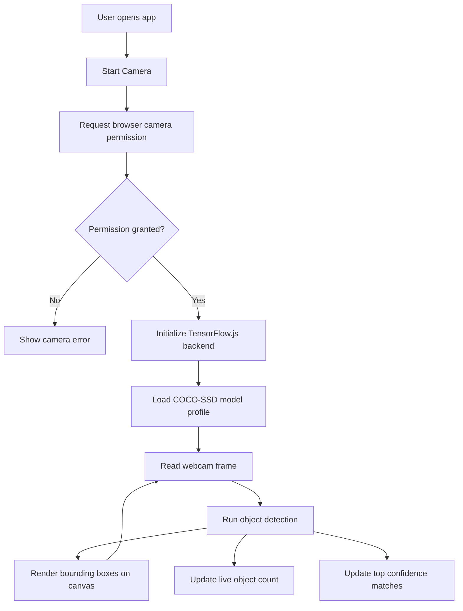
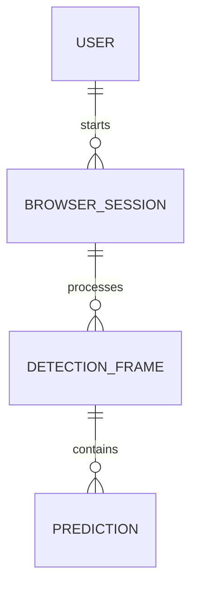
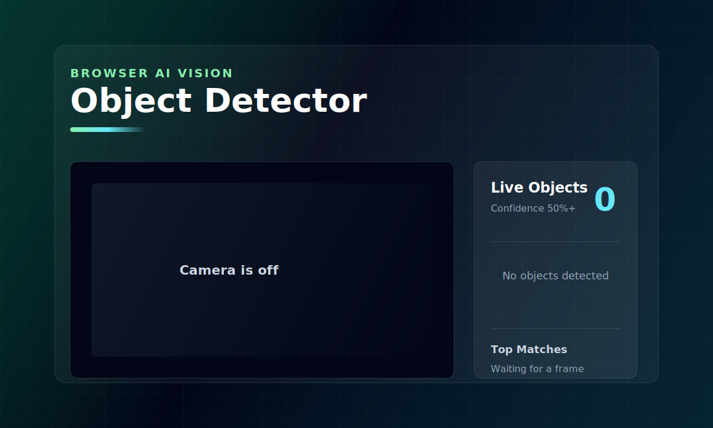
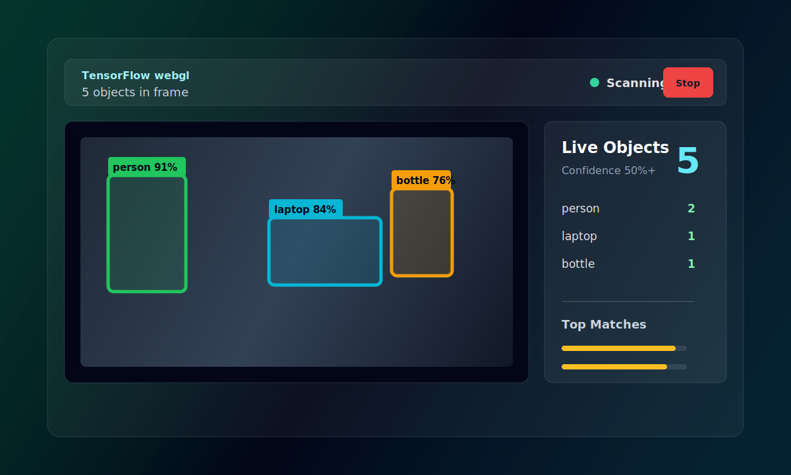
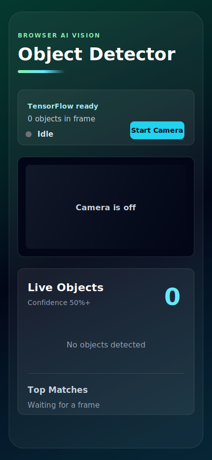

# 🤖 AI Object Detector

A responsive browser-based object detection app built with Next.js, React, TensorFlow.js, and COCO-SSD. It uses the device camera to detect multiple common objects in real time and displays bounding boxes, confidence scores, object counts, and top matches.

## 🚀 Live Demo

Live demo: [https://objectdetector.debarghya.org](https://objectdetector.debarghya.org)

## 💡 Motivation

The goal of this project is to make real-time AI vision easy to access from a normal web browser. Instead of needing a backend server or native mobile app, the model runs directly on the client device using TensorFlow.js.

## ✨ Features

- Real-time object detection from webcam feed
- Multiple object detection in one frame
- Confidence score for each detected object
- Live object count panel
- Top prediction list with progress bars
- Responsive UI for desktop, tablet, and mobile
- iPhone-friendly layout
- Automatic mobile performance mode
- WebGL TensorFlow backend with CPU fallback
- Camera start/stop control
- No database or backend required

## 🏗️ Architecture

### 1. 🧱 3-Tier Client-Server Architecture

```text
+-----------------------------+
| Presentation Layer          |
| Next.js App Router UI       |
| React Components            |
+-------------+---------------+
              |
              v
+-----------------------------+
| Application Layer           |
| Camera State                |
| TensorFlow.js Model Loader  |
| Detection Workflow          |
+-------------+---------------+
              |
              v
+-----------------------------+
| Data Layer                  |
| Browser Camera Stream       |
| COCO-SSD Model Assets       |
| No Persistent Database      |
+-----------------------------+
```

### 2. 🔄 System Architecture & Workflow Diagram



## 📁 Folder Structure

```text
ai_object_detector/
├── app/
│   ├── favicon.ico
│   ├── globals.css
│   ├── layout.tsx
│   └── page.tsx
├── components/
│   └── object-detection.js
├── utils/
│   └── render-predictions.js
├── public/
├── package.json
├── package-lock.json
├── next.config.ts
├── postcss.config.mjs
├── eslint.config.mjs
├── tsconfig.json
└── README.md
```

## 🗄️ Database Design

This project does not use a database. Detection happens fully in the browser and no user data, images, or detection results are stored.

### 1. 📋 Table

| Table Name | Purpose | Status |
|---|---|---|
| N/A | No persistent data storage required | Not used |

### 2. 🔗 Database Schema / Entity Relationship Diagram (ERD)



Note: This ERD represents runtime data flow only. The project does not persist these entities in a database.

## 📸 Screenshots

### Home View



### Detection Running



### Mobile View



## 🛠️ Tech Stack

- Next.js 16
- React 19
- Tailwind CSS 4
- TensorFlow.js
- COCO-SSD model
- React Webcam
- JavaScript / TypeScript project setup
- Vercel for deployment

## ⚙️ Installation

Clone the project:

```bash
git clone https://github.com/debarghya131/ai_object_detector.git
cd ai_object_detector
```

Install dependencies:

```bash
npm install
```

Run locally:

```bash
npm run dev
```

Build for production:

```bash
npm run build
```

Run lint:

```bash
npm run lint
```

## 🔐 Environment Variables

No environment variables are required.

```env
# No .env values needed
```

## 🧩 Challenges Faced

- Handling webcam permission and stream cleanup
- Loading TensorFlow.js correctly in a client-side Next.js component
- Avoiding missing TensorFlow backend runtime errors
- Keeping canvas bounding boxes aligned with the video feed
- Supporting multiple object detections without slowing the browser
- Making the dashboard responsive on mobile screens

## ✅ Solutions Implemented

- Used `"use client"` for webcam and TensorFlow browser APIs
- Initialized TensorFlow.js backend before loading the model
- Added WebGL backend with CPU fallback
- Added camera start/stop controls
- Added interval cleanup and stream track stopping
- Used a fixed aspect-ratio camera frame
- Added live prediction state for object counts and top matches
- Optimized detection loop to prevent overlapping inference calls

## 🧪 Testing

Manual testing checklist:

- App loads without console errors
- Camera permission prompt appears
- Camera starts and stops correctly
- Multiple supported objects are detected
- Bounding boxes align with objects
- Object count updates in real time
- UI works on desktop and mobile viewport
- Production build passes

Commands:

```bash
npm run lint
npm run build
```

## ⚡ Optimization

- Uses COCO-SSD with MobileNet v2 for desktop accuracy
- Uses lightweight COCO-SSD mode on mobile for smoother performance
- Prevents overlapping detection calls
- Uses WebGL acceleration when available
- Limits detection loop frequency
- Keeps all AI inference client-side
- Removes unused static assets before deployment

## 🛡️ Security

- No API keys are exposed
- No server-side database is used
- No camera frames are uploaded to a server
- Camera access requires browser permission
- Detection runs locally in the user's browser
- Vercel deployment provides HTTPS, which is required for camera access

## 🔮 Future Improvements

- Add screenshot capture
- Add detection history
- Add class filter controls
- Add confidence threshold slider
- Add dark/light theme toggle
- Add support for custom trained models
- Add PWA support for mobile installation
- Add automated tests

## 📚 Learnings

- How to use TensorFlow.js inside a Next.js client component
- How to initialize browser AI backends
- How to work with webcam streams in React
- How to render canvas overlays on video
- How to design a responsive AI dashboard
- How to prepare a Next.js project for Vercel deployment

## 👨‍💻 Author Details

**Debarghya Bandyopadhyay**

### 🤝 Be My Friend

I always like to make new friends. Follow me on:

**LinkedIn Profile** 🔗  
[](https://www.linkedin.com/in/debarghya-bandyopadhyay-953b02400?utm_source=share_via&utm_content=profile&utm_medium=member_android)

**X** ✖️  
[](https://x.com/debarghya131)

**GitHub** 🐙  
[](https://github.com/debarghya131)

**Portfolio** 🌐  
[](https://portfolio.debarghya.org)

**Email** 📧  
[](mailto:debarghyabandyopadhyay191@gmail.com)
